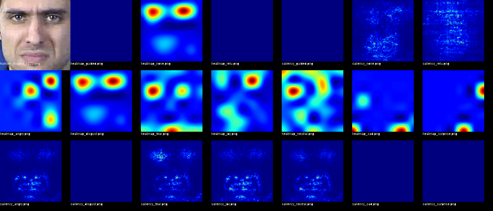

# Understanding Emotion Recognition
### Ivan Montero, Terrell Strong, and Caleb Kierum

A project for CSE 464b to explore what areas of the face neutral networks use to recognize various cardinal expressions.

Our research paper can be found [here](FinalPaper.pdf)