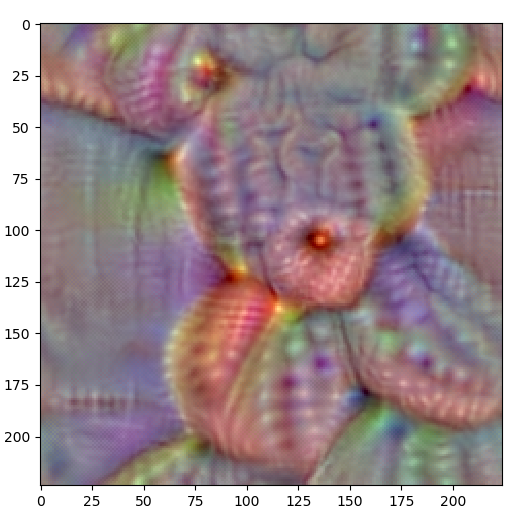

# Deep Dream

Image generation utlizing Google's Deep Dream algorithm.

## Algorithm

Take an input image, and maximize a specific class to elicit a certain interpretation.

https://research.googleblog.com/2015/06/inceptionism-going-deeper-into-neural.html
https://github.com/raghakot/keras-vis
